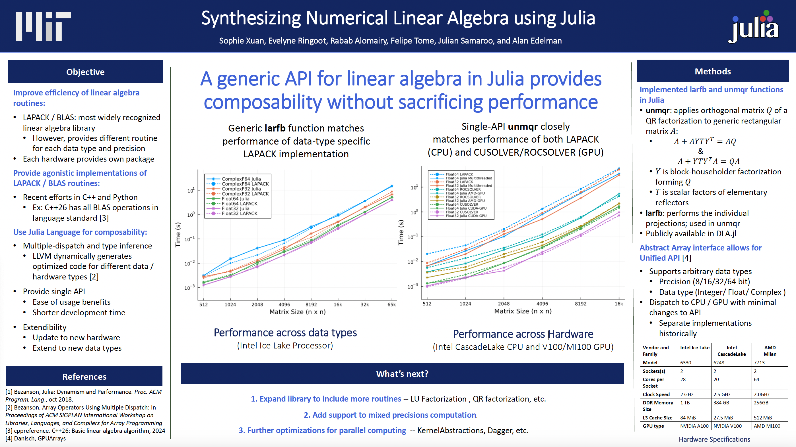

# DLA.jl

[](https://rabab53.github.io/DLA.jl/stable/)
[](https://rabab53.github.io/DLA.jl/dev/)
[](https://github.com/rabab53/DLA.jl/actions/workflows/CI.yml?query=branch%3Amain)
[](https://app.travis-ci.com/rabab53/DLA.jl)
[](https://codecov.io/gh/rabab53/DLA.jl)


**DLA.jl** is a high-performance, hardware-agnostic, and datatype-flexible **dense linear algebra** package implemented in **Julia**. It provides a unified API for linear algebra operations, enabling users to efficiently execute fundamental matrix computations across **CPUs and GPUs** without sacrificing performance.



## 🚀 Features

- **Unified API**: Implements LAPACK/BLAS subroutines in Julia, avoiding type- and hardware-specific implementations.
- **Multi-Architecture Support**: Efficiently runs on **CPUs and GPUs**, leveraging Julia's LLVM-based compilation.
- **High Performance**: Benchmarks show that Julia-based implementations achieve **performance on par with or exceeding LAPACK/CUSOLVER**.
- **Broad Datatype Support**: Supports **Float64, Float32, Float16, complex numbers**, and other numerical types seamlessly.
- **Future-Proof & Composable**: Designed for extensibility, allowing new data types and hardware architectures to be integrated with minimal modifications.

## 📌 Why Julia for Dense Linear Algebra?

Traditionally, linear algebra libraries have been optimized for **Fortran and C**, requiring separate implementations for different hardware and data types. **DLA.jl** leverages Julia’s **multiple dispatch, type inference, and metaprogramming capabilities** to dynamically generate optimized machine code, making it a future-proof alternative.

## 📈 Performance

Benchmarks indicate that **DLA.jl** achieves performance **comparable to or better than** state-of-art for medium to large problem sizes. Key highlights:

- **Close to native performance** across different data types.
- **No need for separate CPU/GPU implementations**—a single API works across both.
- **Efficient parallel execution**, taking advantage of Julia's **multi-threading and GPU acceleration**.

## 📚 References

```bibtex
@inproceedings{dla,
  title={{Synthesizing Numerical Linear Algebra using Julia}},
  author={Xuan, Sophie and Ringoot, Evelyne and Alomairy, Rabab and Tome, Felipe and Samaroo, Julian and Edelman, Alan},
  booktitle={2024 IEEE High Performance Extreme Computing Conference (HPEC)},
  year={2024},
  organization={IEEE}
}
```
## 👥 Contributors

- **Rabab Alomairy** (@Rabab53)
- **Sophie Xuan** (@Azura-yuwi)
- **Evelyne Ringoot** (@evelyne-ringoot)
- **Vicki Carrica** (@vickicarrica)
- **Maxwell Onyango** (@maxmlewa)
- **Julian Samaroo** (@jpsamaroo)
